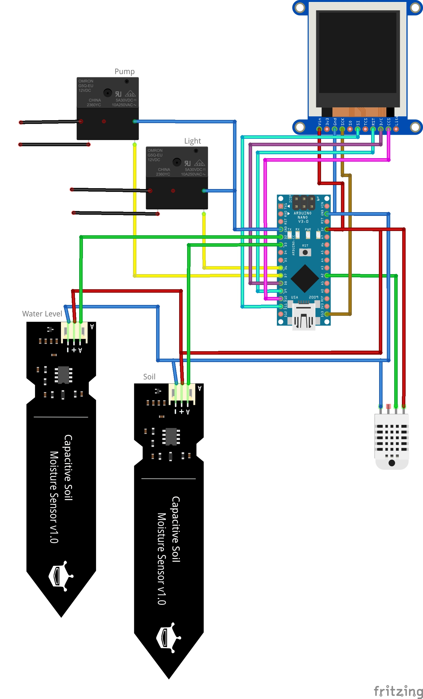

# A.G.N.E.S.
### Automated Garden & Nurturing Environment System 
 

## Meet A.G.N.E.S.
I'll answer the biggest question first. Why Agnes? This was very much a case of I wanted a cool name for this thing, then came up with the acronym later. Also, as one may be able to tell, heavily inspired by GLaDOS, which could be a good or a bad thing depending on your opinion on evil omnipresent AIs.

Agnes was designed with the intent of automating a small herb box, flower pot, or with upgrades that can be easily added with some quick fixes to the code and a better central processor, a small garden or greenhouse. The two main focuses of Agnes are water and light. Light is easy, just turning on and off according to an internal timer. Watering is done every 12th hour of every day. Every 5 minutes during the 12th hour, the soil moisture is checked. If the moisture level is low, a pump is turned on to send water through a tube and onto the soil. A DHT is also added to monitor the surrounding air temperature and humidity. This information isn't used to judge lighting or water, but is displayed to the user on a screen to show environmental details, as well as soil moisture and system time.

## The Wiring
The wiring can be seen in the Fritzing file below, as well as the .fzz file and PDF in the repo. The red and blue wires represent 5V and ground, and the other colored wires are basic I/O and data wires. The black wires coming off the relays splice into the 120V supply of the lamp and water pump. It is highly recommended to use capacitive soil moisture sensors over traditional bare metal sensors as they last much longer. 

Here it is worth noting that I do not consider myself an electrical engineer, not even as a hobbyist. While I have built this and there were no fires, I cannot at all guarantee that controlling mains voltage or having this many 5V and ground connections on an Arduino nano is safe. If I had one spare, I may have preferred an Arduino Uno. I also did a considerable amount of searching online, but wasn't able to find a better solution for controlling the lamp and pump than 2 120V relays. I would love to not have to deal with cutting and tapping into the 120V cables, but for now it seems to work. These are 2 improvements I hope to make on Agnes V2.

## Important Physical Design  
### The water reservoir
I constructed my water reservoir by submerging a small fish tank pump into a 5 gallon bucket and running a 1 inch flexible PVC tube up to the plant. About 2 inches above the top of the pump I cut a slit to slide the water detecting sensor in and sealed it with silicon putty. This sensor will return a low value when the water level dips too low and displays a message to the screen. 

### The water tube
The water tube was a 1 inch flexible PVC tube running from the water bucket up to the plants. It was mounted just above the soil and had many small holes drilled in it to let the water out. The pump on time may need to be adjusted the code based on your water delivery method.

### The brains box
The Arduino was encased in a waterproof project box mounted to the side of the plant box. Holes were drilled to allow all the sensor wires in as well as the 120V wires to the relays that were also housed inside. A hole was cut in the front to allow the screen to fit.

## Flaws and To-Do

The biggest 2 are make sure the power supply of the Arduino isn't being overloaded and find a better way to control the mains voltage. 

Understanding electrical engineering would also be a good start.

For version 2, I intend on using a WiFi enabled microcontroller to allow the user to monitor stats on a local website, as well as see watering and soil moisture history. This would also allow for a more refined way for the user to set variables. 

## Final notes

Working on A.G.N.E.S. during college and having to juggle lack of time, materials, and space, its far rom perfect. Hopefully this is a good jumping off point for version 2 which will more closely resemble a more formal project. Until then, all the code and designs are open source and ready for builds and improvements!
